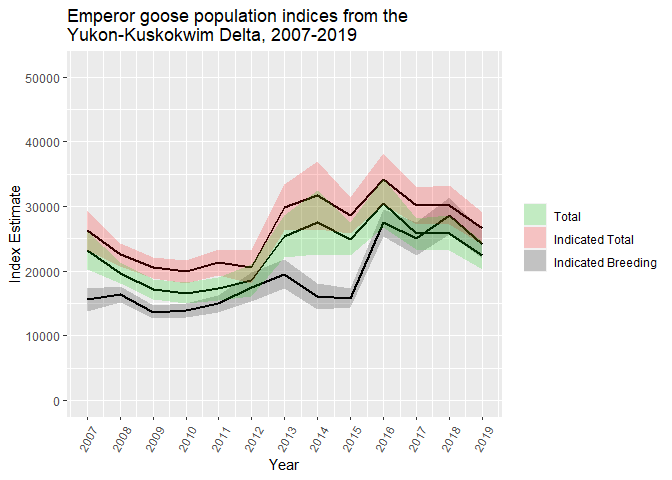
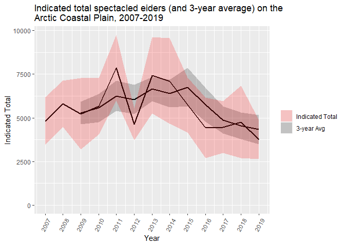

<!-- README.md is generated from README.Rmd. Please edit that file -->

AKaerial
========

<!-- badges: start -->
<!-- badges: end -->

The goal of AKaerial is to provide a transparent and repeatable workflow
to generate, visualize, and report out estimates from the suite of
aerial surveys undertaken by the Division of Migratory Bird Management
(MBM) in the Alaska Region of the US Fish and Wildlife Service. Pilots
and observers in the Alaska Region have been collecting aerial survey
data on waterfowl for over 50 years. In general, a pilot and observer
fly low-level transects over a designated habitat-based study area
(usually breeding grounds) and record observations of single drakes (or
single birds for monomorphic species), breeding pairs, and flocks.
Observations are summarized as densities, and densities are extrapolated
to population indices. Resultant indices are sometimes used in harvest
management decisions by both state and federal agencies. AKaerial was
created not only to streamline these steps, but to provide a
transparent, repeatable, and defensible alternative to past
estimate-generating processes.

The most likely use of AKaerial would be to take advantage of the
historic tables of estimates contained as data objects within the package for projects on the Arctic Coastal Plain (ACPHistoric, 2007-2019), Copper River Delta (CRDHistoric, 1986-2019), and Yukon-Kuskokwim
River Delta for ducks (YKDHistoric), 1988-2019)
and geese (YKGHistoric, 1985-2019). AKaerial
includes figure-, table-, and map-generating functions that are designed
to visualize data, design files, and estimates as a quality control step
as well as for the production of reports, presentations, and
manuscripts.

AKaerial also includes a function (GreenLight)
that provides a rigorous and documented quality control process. This
results in a structured and consistent treatment of both raw transcribed
and archived data files throughout the data life cycle.

Bugs, Issues, Feature Requests
------------------------------

AKaerial is under constant development. It will have occasional bugs and
other issues. Please report any issues or feature requests on the
[AKaerial Github repository](https://github.com/USFWS/AKaerial/issues).

Installation
------------

You can install the released version of AKaerial from
[GitHub](https://github.com/) with:

    # install.packages("devtools")
    devtools::install_github("USFWS/AKaerial", ref = "master", build_vignettes = TRUE)

And the development version from [GitHub](https://github.com/) with:

    # install.packages("devtools")
    devtools::install_github("USFWS/AKaerial", ref = "development", build_vignettes = TRUE)

Then explore the vignettes with:

    vignette("IntroToAKaerial", package="AKaerial")

Examples
--------

Below are several examples of functions in AKaerial that check, process,
and summarize data and observations.

To visualize historic estimates as tables or figures:

    library(AKaerial)

    ReportFigure(data=YKGHistoric$combined, 
                 species="EMGO", 
                 index=c("total", "total.var", "itotal", "itotal.var", "ibb", "ibb.var"),
                 year=c(2007:2019), 
                 title="Emperor goose population indices from the \nYukon-Kuskokwim Delta, 2007-2019", 
                 x.label = "Year", 
                 y.label="Index Estimate", 
                 leg.values = c(3,2,1), 
                 leg.labels = c("Total", "Indicated Total", "Indicated Breeding"), 
                 leg.limits = c("total", "itotal", "ibb"),
                 test.out = FALSE)

    ReportFigure(data=ACPHistoric$combined, 
                 species="SPEI", 
                 index=c("itotal", "itotal.var"),
                 year=c(2007:2019),
                 yr.avg=3,
                 title="Indicated total spectacled eiders (and 3-year average) on the \nArctic Coastal Plain, 2007-2019", 
                 x.label = "Year", 
                 y.label="Indicated Total", 
                 leg.values = c(2,1), 
                 leg.labels = c("Indicated Total", "3-year Avg"), 
                 leg.limits = c("itotal", "avg1"),
                 test.out = FALSE)

    ReportTable(data=YKDHistoric$combined, 
                species="SPEI", 
                index=c("itotal", "itotal.var"),
                year=c(1988:2019), 
                yr.avg=3, 
                cap="Indicated total spectacled eiders on the Yukon-Kuskokwim Delta, 1988-2019.", 
                new.names=c("Year", "Indicated Total", "SE", "3-yr Avg", "SE"))

<table class="table table-bordered" style="font-size: 14px; width: auto !important; margin-left: auto; margin-right: auto;">
<caption style="font-size: initial !important;">
Indicated total spectacled eiders on the Yukon-Kuskokwim Delta,
1988-2019.
</caption>
<thead>
<tr>
<th style="text-align:right;">
Year
</th>
<th style="text-align:right;">
Indicated Total
</th>
<th style="text-align:right;">
SE
</th>
<th style="text-align:left;">
3-yr Avg
</th>
<th style="text-align:left;">
SE
</th>
</tr>
</thead>
<tbody>
<tr>
<td style="text-align:right;">
1988
</td>
<td style="text-align:right;">
1835
</td>
<td style="text-align:right;">
314
</td>
<td style="text-align:left;">
NA
</td>
<td style="text-align:left;">
NA
</td>
</tr>
<tr>
<td style="text-align:right;">
1989
</td>
<td style="text-align:right;">
1538
</td>
<td style="text-align:right;">
227
</td>
<td style="text-align:left;">
NA
</td>
<td style="text-align:left;">
NA
</td>
</tr>
<tr>
<td style="text-align:right;">
1990
</td>
<td style="text-align:right;">
1955
</td>
<td style="text-align:right;">
289
</td>
<td style="text-align:left;">
1776
</td>
<td style="text-align:left;">
129
</td>
</tr>
<tr>
<td style="text-align:right;">
1991
</td>
<td style="text-align:right;">
1259
</td>
<td style="text-align:right;">
231
</td>
<td style="text-align:left;">
1584
</td>
<td style="text-align:left;">
123
</td>
</tr>
<tr>
<td style="text-align:right;">
1992
</td>
<td style="text-align:right;">
1097
</td>
<td style="text-align:right;">
171
</td>
<td style="text-align:left;">
1437
</td>
<td style="text-align:left;">
123
</td>
</tr>
<tr>
<td style="text-align:right;">
1993
</td>
<td style="text-align:right;">
2302
</td>
<td style="text-align:right;">
328
</td>
<td style="text-align:left;">
1553
</td>
<td style="text-align:left;">
96
</td>
</tr>
<tr>
<td style="text-align:right;">
1994
</td>
<td style="text-align:right;">
2280
</td>
<td style="text-align:right;">
326
</td>
<td style="text-align:left;">
1893
</td>
<td style="text-align:left;">
123
</td>
</tr>
<tr>
<td style="text-align:right;">
1995
</td>
<td style="text-align:right;">
2426
</td>
<td style="text-align:right;">
355
</td>
<td style="text-align:left;">
2336
</td>
<td style="text-align:left;">
154
</td>
</tr>
<tr>
<td style="text-align:right;">
1996
</td>
<td style="text-align:right;">
2416
</td>
<td style="text-align:right;">
348
</td>
<td style="text-align:left;">
2374
</td>
<td style="text-align:left;">
160
</td>
</tr>
<tr>
<td style="text-align:right;">
1997
</td>
<td style="text-align:right;">
2210
</td>
<td style="text-align:right;">
335
</td>
<td style="text-align:left;">
2351
</td>
<td style="text-align:left;">
166
</td>
</tr>
<tr>
<td style="text-align:right;">
1998
</td>
<td style="text-align:right;">
2630
</td>
<td style="text-align:right;">
283
</td>
<td style="text-align:left;">
2419
</td>
<td style="text-align:left;">
161
</td>
</tr>
<tr>
<td style="text-align:right;">
1999
</td>
<td style="text-align:right;">
3224
</td>
<td style="text-align:right;">
529
</td>
<td style="text-align:left;">
2688
</td>
<td style="text-align:left;">
146
</td>
</tr>
<tr>
<td style="text-align:right;">
2000
</td>
<td style="text-align:right;">
2849
</td>
<td style="text-align:right;">
285
</td>
<td style="text-align:left;">
2901
</td>
<td style="text-align:left;">
200
</td>
</tr>
<tr>
<td style="text-align:right;">
2001
</td>
<td style="text-align:right;">
3483
</td>
<td style="text-align:right;">
384
</td>
<td style="text-align:left;">
3185
</td>
<td style="text-align:left;">
200
</td>
</tr>
<tr>
<td style="text-align:right;">
2002
</td>
<td style="text-align:right;">
3873
</td>
<td style="text-align:right;">
324
</td>
<td style="text-align:left;">
3402
</td>
<td style="text-align:left;">
159
</td>
</tr>
<tr>
<td style="text-align:right;">
2003
</td>
<td style="text-align:right;">
3496
</td>
<td style="text-align:right;">
376
</td>
<td style="text-align:left;">
3617
</td>
<td style="text-align:left;">
168
</td>
</tr>
<tr>
<td style="text-align:right;">
2004
</td>
<td style="text-align:right;">
2581
</td>
<td style="text-align:right;">
287
</td>
<td style="text-align:left;">
3317
</td>
<td style="text-align:left;">
166
</td>
</tr>
<tr>
<td style="text-align:right;">
2005
</td>
<td style="text-align:right;">
4238
</td>
<td style="text-align:right;">
414
</td>
<td style="text-align:left;">
3438
</td>
<td style="text-align:left;">
158
</td>
</tr>
<tr>
<td style="text-align:right;">
2006
</td>
<td style="text-align:right;">
4862
</td>
<td style="text-align:right;">
460
</td>
<td style="text-align:left;">
3894
</td>
<td style="text-align:left;">
168
</td>
</tr>
<tr>
<td style="text-align:right;">
2007
</td>
<td style="text-align:right;">
4849
</td>
<td style="text-align:right;">
482
</td>
<td style="text-align:left;">
4650
</td>
<td style="text-align:left;">
206
</td>
</tr>
<tr>
<td style="text-align:right;">
2008
</td>
<td style="text-align:right;">
5693
</td>
<td style="text-align:right;">
509
</td>
<td style="text-align:left;">
5135
</td>
<td style="text-align:left;">
222
</td>
</tr>
<tr>
<td style="text-align:right;">
2009
</td>
<td style="text-align:right;">
6525
</td>
<td style="text-align:right;">
495
</td>
<td style="text-align:left;">
5689
</td>
<td style="text-align:left;">
234
</td>
</tr>
<tr>
<td style="text-align:right;">
2010
</td>
<td style="text-align:right;">
5290
</td>
<td style="text-align:right;">
494
</td>
<td style="text-align:left;">
5836
</td>
<td style="text-align:left;">
237
</td>
</tr>
<tr>
<td style="text-align:right;">
2012
</td>
<td style="text-align:right;">
5982
</td>
<td style="text-align:right;">
465
</td>
<td style="text-align:left;">
5932
</td>
<td style="text-align:left;">
233
</td>
</tr>
<tr>
<td style="text-align:right;">
2013
</td>
<td style="text-align:right;">
6749
</td>
<td style="text-align:right;">
515
</td>
<td style="text-align:left;">
6007
</td>
<td style="text-align:left;">
226
</td>
</tr>
<tr>
<td style="text-align:right;">
2014
</td>
<td style="text-align:right;">
5729
</td>
<td style="text-align:right;">
496
</td>
<td style="text-align:left;">
6153
</td>
<td style="text-align:left;">
231
</td>
</tr>
<tr>
<td style="text-align:right;">
2015
</td>
<td style="text-align:right;">
2475
</td>
<td style="text-align:right;">
342
</td>
<td style="text-align:left;">
4984
</td>
<td style="text-align:left;">
238
</td>
</tr>
<tr>
<td style="text-align:right;">
2016
</td>
<td style="text-align:right;">
6209
</td>
<td style="text-align:right;">
549
</td>
<td style="text-align:left;">
4804
</td>
<td style="text-align:left;">
201
</td>
</tr>
<tr>
<td style="text-align:right;">
2017
</td>
<td style="text-align:right;">
6870
</td>
<td style="text-align:right;">
509
</td>
<td style="text-align:left;">
5185
</td>
<td style="text-align:left;">
216
</td>
</tr>
<tr>
<td style="text-align:right;">
2018
</td>
<td style="text-align:right;">
6664
</td>
<td style="text-align:right;">
497
</td>
<td style="text-align:left;">
6581
</td>
<td style="text-align:left;">
250
</td>
</tr>
<tr>
<td style="text-align:right;">
2019
</td>
<td style="text-align:right;">
6057
</td>
<td style="text-align:right;">
524
</td>
<td style="text-align:left;">
6530
</td>
<td style="text-align:left;">
237
</td>
</tr>
</tbody>
</table>

    ReportTable(data=CRDHistoric$combined, 
                species="DCGO", 
                index=c("total", "total.var", "itotal", "itotal.var"),
                year=c(1995:2019), 
                yr.avg=3, 
                cap="Total and indicated total dusky Canada geese on the Copper River Delta, 1995-2019.", 
                new.names=c("Year", "Total", "SE", "3-yr Avg", "SE", "Indicated Total", "SE", "3-yr Avg", "SE"))

<table class="table table-bordered" style="font-size: 14px; width: auto !important; margin-left: auto; margin-right: auto;">
<caption style="font-size: initial !important;">
Total and indicated total dusky Canada geese on the Copper River Delta,
1995-2019.
</caption>
<thead>
<tr>
<th style="text-align:right;">
Year
</th>
<th style="text-align:right;">
Total
</th>
<th style="text-align:right;">
SE
</th>
<th style="text-align:left;">
3-yr Avg
</th>
<th style="text-align:left;">
SE
</th>
<th style="text-align:right;">
Indicated Total
</th>
<th style="text-align:right;">
SE
</th>
<th style="text-align:left;">
3-yr Avg
</th>
<th style="text-align:left;">
SE
</th>
</tr>
</thead>
<tbody>
<tr>
<td style="text-align:right;">
1995
</td>
<td style="text-align:right;">
3146
</td>
<td style="text-align:right;">
274
</td>
<td style="text-align:left;">
NA
</td>
<td style="text-align:left;">
NA
</td>
<td style="text-align:right;">
3596
</td>
<td style="text-align:right;">
304
</td>
<td style="text-align:left;">
NA
</td>
<td style="text-align:left;">
NA
</td>
</tr>
<tr>
<td style="text-align:right;">
1996
</td>
<td style="text-align:right;">
2724
</td>
<td style="text-align:right;">
234
</td>
<td style="text-align:left;">
NA
</td>
<td style="text-align:left;">
NA
</td>
<td style="text-align:right;">
3359
</td>
<td style="text-align:right;">
265
</td>
<td style="text-align:left;">
NA
</td>
<td style="text-align:left;">
NA
</td>
</tr>
<tr>
<td style="text-align:right;">
1997
</td>
<td style="text-align:right;">
3239
</td>
<td style="text-align:right;">
200
</td>
<td style="text-align:left;">
3036
</td>
<td style="text-align:left;">
120
</td>
<td style="text-align:right;">
3816
</td>
<td style="text-align:right;">
213
</td>
<td style="text-align:left;">
3590
</td>
<td style="text-align:left;">
135
</td>
</tr>
<tr>
<td style="text-align:right;">
1998
</td>
<td style="text-align:right;">
4344
</td>
<td style="text-align:right;">
346
</td>
<td style="text-align:left;">
3436
</td>
<td style="text-align:left;">
103
</td>
<td style="text-align:right;">
4876
</td>
<td style="text-align:right;">
357
</td>
<td style="text-align:left;">
4017
</td>
<td style="text-align:left;">
113
</td>
</tr>
<tr>
<td style="text-align:right;">
1999
</td>
<td style="text-align:right;">
2540
</td>
<td style="text-align:right;">
203
</td>
<td style="text-align:left;">
3374
</td>
<td style="text-align:left;">
133
</td>
<td style="text-align:right;">
2997
</td>
<td style="text-align:right;">
209
</td>
<td style="text-align:left;">
3896
</td>
<td style="text-align:left;">
139
</td>
</tr>
<tr>
<td style="text-align:right;">
2000
</td>
<td style="text-align:right;">
2448
</td>
<td style="text-align:right;">
161
</td>
<td style="text-align:left;">
3111
</td>
<td style="text-align:left;">
134
</td>
<td style="text-align:right;">
2879
</td>
<td style="text-align:right;">
175
</td>
<td style="text-align:left;">
3584
</td>
<td style="text-align:left;">
138
</td>
</tr>
<tr>
<td style="text-align:right;">
2001
</td>
<td style="text-align:right;">
2648
</td>
<td style="text-align:right;">
188
</td>
<td style="text-align:left;">
2545
</td>
<td style="text-align:left;">
87
</td>
<td style="text-align:right;">
3152
</td>
<td style="text-align:right;">
203
</td>
<td style="text-align:left;">
3009
</td>
<td style="text-align:left;">
91
</td>
</tr>
<tr>
<td style="text-align:right;">
2002
</td>
<td style="text-align:right;">
3262
</td>
<td style="text-align:right;">
268
</td>
<td style="text-align:left;">
2786
</td>
<td style="text-align:left;">
82
</td>
<td style="text-align:right;">
3891
</td>
<td style="text-align:right;">
285
</td>
<td style="text-align:left;">
3307
</td>
<td style="text-align:left;">
89
</td>
</tr>
<tr>
<td style="text-align:right;">
2003
</td>
<td style="text-align:right;">
2778
</td>
<td style="text-align:right;">
209
</td>
<td style="text-align:left;">
2896
</td>
<td style="text-align:left;">
109
</td>
<td style="text-align:right;">
3163
</td>
<td style="text-align:right;">
227
</td>
<td style="text-align:left;">
3402
</td>
<td style="text-align:left;">
117
</td>
</tr>
<tr>
<td style="text-align:right;">
2004
</td>
<td style="text-align:right;">
2476
</td>
<td style="text-align:right;">
200
</td>
<td style="text-align:left;">
2839
</td>
<td style="text-align:left;">
113
</td>
<td style="text-align:right;">
3182
</td>
<td style="text-align:right;">
233
</td>
<td style="text-align:left;">
3412
</td>
<td style="text-align:left;">
121
</td>
</tr>
<tr>
<td style="text-align:right;">
2005
</td>
<td style="text-align:right;">
4708
</td>
<td style="text-align:right;">
628
</td>
<td style="text-align:left;">
3321
</td>
<td style="text-align:left;">
96
</td>
<td style="text-align:right;">
5240
</td>
<td style="text-align:right;">
664
</td>
<td style="text-align:left;">
3862
</td>
<td style="text-align:left;">
108
</td>
</tr>
<tr>
<td style="text-align:right;">
2006
</td>
<td style="text-align:right;">
2736
</td>
<td style="text-align:right;">
213
</td>
<td style="text-align:left;">
3307
</td>
<td style="text-align:left;">
220
</td>
<td style="text-align:right;">
3074
</td>
<td style="text-align:right;">
228
</td>
<td style="text-align:left;">
3832
</td>
<td style="text-align:left;">
235
</td>
</tr>
<tr>
<td style="text-align:right;">
2007
</td>
<td style="text-align:right;">
2289
</td>
<td style="text-align:right;">
182
</td>
<td style="text-align:left;">
3244
</td>
<td style="text-align:left;">
221
</td>
<td style="text-align:right;">
2868
</td>
<td style="text-align:right;">
213
</td>
<td style="text-align:left;">
3727
</td>
<td style="text-align:left;">
234
</td>
</tr>
<tr>
<td style="text-align:right;">
2008
</td>
<td style="text-align:right;">
1972
</td>
<td style="text-align:right;">
154
</td>
<td style="text-align:left;">
2332
</td>
<td style="text-align:left;">
93
</td>
<td style="text-align:right;">
2523
</td>
<td style="text-align:right;">
188
</td>
<td style="text-align:left;">
2822
</td>
<td style="text-align:left;">
104
</td>
</tr>
<tr>
<td style="text-align:right;">
2009
</td>
<td style="text-align:right;">
1364
</td>
<td style="text-align:right;">
157
</td>
<td style="text-align:left;">
1875
</td>
<td style="text-align:left;">
79
</td>
<td style="text-align:right;">
1737
</td>
<td style="text-align:right;">
174
</td>
<td style="text-align:left;">
2376
</td>
<td style="text-align:left;">
95
</td>
</tr>
<tr>
<td style="text-align:right;">
2010
</td>
<td style="text-align:right;">
2139
</td>
<td style="text-align:right;">
170
</td>
<td style="text-align:left;">
1825
</td>
<td style="text-align:left;">
73
</td>
<td style="text-align:right;">
2678
</td>
<td style="text-align:right;">
191
</td>
<td style="text-align:left;">
2313
</td>
<td style="text-align:left;">
85
</td>
</tr>
<tr>
<td style="text-align:right;">
2011
</td>
<td style="text-align:right;">
3036
</td>
<td style="text-align:right;">
336
</td>
<td style="text-align:left;">
2180
</td>
<td style="text-align:left;">
77
</td>
<td style="text-align:right;">
3524
</td>
<td style="text-align:right;">
351
</td>
<td style="text-align:left;">
2646
</td>
<td style="text-align:left;">
86
</td>
</tr>
<tr>
<td style="text-align:right;">
2012
</td>
<td style="text-align:right;">
3222
</td>
<td style="text-align:right;">
295
</td>
<td style="text-align:left;">
2799
</td>
<td style="text-align:left;">
125
</td>
<td style="text-align:right;">
3880
</td>
<td style="text-align:right;">
325
</td>
<td style="text-align:left;">
3361
</td>
<td style="text-align:left;">
133
</td>
</tr>
<tr>
<td style="text-align:right;">
2014
</td>
<td style="text-align:right;">
4056
</td>
<td style="text-align:right;">
287
</td>
<td style="text-align:left;">
3438
</td>
<td style="text-align:left;">
149
</td>
<td style="text-align:right;">
4501
</td>
<td style="text-align:right;">
288
</td>
<td style="text-align:left;">
3968
</td>
<td style="text-align:left;">
159
</td>
</tr>
<tr>
<td style="text-align:right;">
2015
</td>
<td style="text-align:right;">
5050
</td>
<td style="text-align:right;">
459
</td>
<td style="text-align:left;">
4109
</td>
<td style="text-align:left;">
137
</td>
<td style="text-align:right;">
6024
</td>
<td style="text-align:right;">
487
</td>
<td style="text-align:left;">
4802
</td>
<td style="text-align:left;">
145
</td>
</tr>
<tr>
<td style="text-align:right;">
2016
</td>
<td style="text-align:right;">
3442
</td>
<td style="text-align:right;">
309
</td>
<td style="text-align:left;">
4183
</td>
<td style="text-align:left;">
180
</td>
<td style="text-align:right;">
4026
</td>
<td style="text-align:right;">
315
</td>
<td style="text-align:left;">
4850
</td>
<td style="text-align:left;">
189
</td>
</tr>
<tr>
<td style="text-align:right;">
2017
</td>
<td style="text-align:right;">
3065
</td>
<td style="text-align:right;">
238
</td>
<td style="text-align:left;">
3852
</td>
<td style="text-align:left;">
184
</td>
<td style="text-align:right;">
3544
</td>
<td style="text-align:right;">
248
</td>
<td style="text-align:left;">
4531
</td>
<td style="text-align:left;">
193
</td>
</tr>
<tr>
<td style="text-align:right;">
2018
</td>
<td style="text-align:right;">
2552
</td>
<td style="text-align:right;">
242
</td>
<td style="text-align:left;">
3020
</td>
<td style="text-align:left;">
130
</td>
<td style="text-align:right;">
3179
</td>
<td style="text-align:right;">
256
</td>
<td style="text-align:left;">
3583
</td>
<td style="text-align:left;">
134
</td>
</tr>
<tr>
<td style="text-align:right;">
2019
</td>
<td style="text-align:right;">
6228
</td>
<td style="text-align:right;">
2039
</td>
<td style="text-align:left;">
3948
</td>
<td style="text-align:left;">
113
</td>
<td style="text-align:right;">
6873
</td>
<td style="text-align:right;">
2040
</td>
<td style="text-align:left;">
4532
</td>
<td style="text-align:left;">
119
</td>
</tr>
</tbody>
</table>
